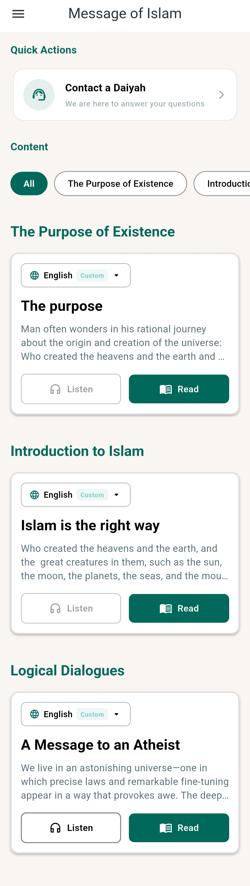
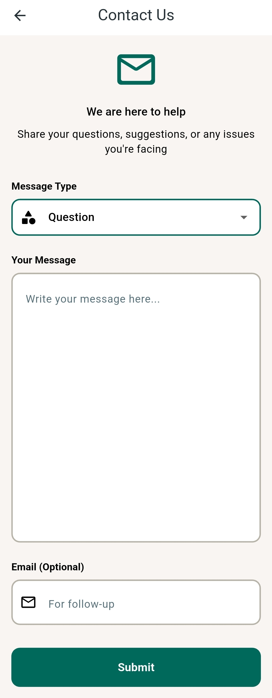

# Islamic Message (رسالة الإسلام)

An elegant, performant Flutter application designed to provide daily Islamic messages, authentic Quranic content, and high-quality audio recitations. Built with a focus on **offline-first reliability**, **accessibility**, and **modern architecture**.

---

## Preview

| Home | Reader | Contact us |
| :---: | :---: | :---: |
|  |  |  |

--

## Key Features

- **Immersive Reader**: A custom-built reading experience supporting Uthmanic and Noto Naskh fonts, adjustable font sizes, and side-by-side translations.
- **Feature-Rich Audio**: Background playback support, speed control, and session management (interruption handling for calls/notifications).
- **Smart Synchronization**: Throttled background sync (15-min intervals) with Supabase to keep content updated without draining battery or data.
- **Offline-First**: Fully functional without internet. All content, bookmarks, and even analytics interactions are cached locally using Drift (SQLite).
- **Premium UI/UX**: Supports Light/Dark modes, smooth transitions, and RTL/LTR switching.
- **Accessibility**: Clamped text scaling (max 1.4x) to ensure UI integrity while supporting large text preferences.

## Technical Architecture

The project follows a **Feature-First / Clean Architecture** approach, ensuring scalability and testability:

- **State Management**: `flutter_riverpod` for reactive, testable state handling.
- **Persistence**: `drift` (SQLite) for high-performance structured local storage.
- **Backend**: `supabase_flutter` for real-time data sync and authentication.
- **Error Tracking**: `sentry_flutter` for automated crash reporting and performance monitoring.
- **Networking**: `dio` and `http` for resilient API communication.

```text
lib/
├── core/           # App config, constants, and shared utilities
├── data/           # Local/Remote data sources and repositories
├── features/       # Feature-specific logic (Reader, Declare Islam, etc.)
├── presentation/   # UI Screens, Widgets, and Themes
└── providers/      # Global Riverpod providers
```

## Tech Stack

- **Framework**: Flutter (Dart)
- **Database**: Drift (SQLite)
- **API/Auth**: Supabase
- **Audio**: just_audio, audio_service
- **Analytics**: Sentry
- **Fonts**: Google Fonts (Noto Naskh Arabic, Uthmanic Hafs)

## Getting Started

### Prerequisites

- Flutter SDK (^3.7.2)
- A Supabase Project

### Environment Variables

This project uses `dart-define` for secure configuration. You **must** provide the following variables at build time:

```bash
# Running the app
flutter run \
  --dart-define=SUPABASE_URL="https://your-project.supabase.co" \
  --dart-define=SUPABASE_ANON_KEY="your-anon-key" \
  --dart-define=SENTRY_DSN="optional-sentry-dsn"
```

### Installation

1. Clone the repository:
   ```bash
   git clone https://github.com/your-username/alghaya_men_alkhalg.git
   ```
2. Install dependencies:
   ```bash
   flutter pub get
   ```
3. Generate local database code:
   ```bash
   dart run build_runner build --delete-conflicting-outputs
   ```

## Security & Privacy

- **No Hardcoded Secrets**: All API keys and endpoints are injected at compile-time via `dart-define`.
- **Local Encryption**: (Future improvement) Local storage is currently plain SQLite via Drift.
- **Anonymous Analytics**: Sentry is configured to respect user privacy; no PII (Personally Identifiable Information) is sent.

## Project Status

The app is currently in active development, focusing on final release readiness, robust offline sync, and advanced analytics integrations.


